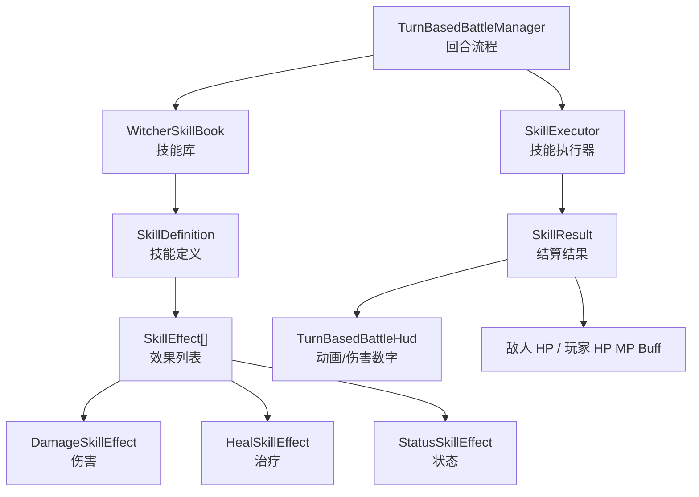

# 回合制技能框架

## 设计思路

当前回合制战斗已经从实时割草逻辑收敛成 JRPG 战斗。技能框架的目标是让“技能是什么”和“回合怎么流转”分开：

- `TurnBasedBattleManager` 只负责当前是谁行动、玩家选择了什么、战斗是否结束。
- `SkillDefinition` 描述技能名字、消耗、目标类型、动画类型和效果列表。
- `SkillEffect` 描述技能实际效果，例如伤害、治疗、加 Buff。
- `SkillExecutor` 统一执行技能，并输出 `SkillResult` 给 HUD 播动画、跳数字。
- `WitcherSkillBook` 集中创建默认技能，后续新增技能优先在这里添加。

## 代码图



## 新增技能示例

```csharp
public static SkillDefinition CreateFireball()
{
    return new SkillDefinition(
        BattleSkillId.Fireball,
        "火球术",
        16,
        BattleSkillTargetKind.FirstLivingEnemy,
        BattleSkillAnimationKind.Flame,
        "火球砸向怪物！",
        new DamageSkillEffect(34, 0f, 0.35f, 1, BattleDamageType.Fire));
}
```

## 已覆盖能力

- 单体物理攻击：`CreateBasicAttack`
- 全体火焰攻击：`CreateFlameSign`
- 自身防御 Buff：`CreateDefend`
- 自身治疗物品：`CreatePotion`
- 连续斩杀示例：`CreateExecuteSlash`
- 单体火球示例：`CreateFireball`
- 远程 AOE 示例：`CreateArcaneBurst`
- 自身攻击 Buff 示例：`CreateHunterFocus`
